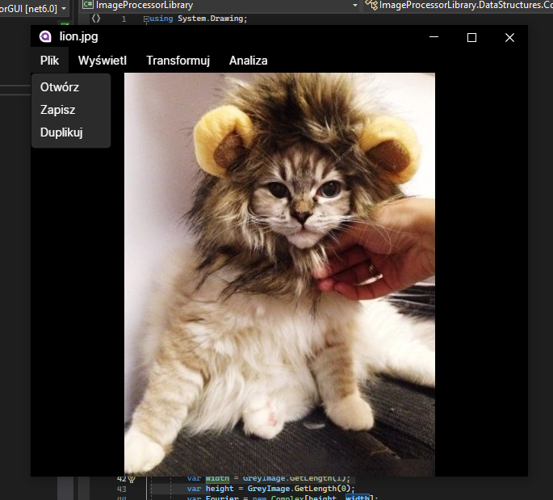

# ImageProcessor

Projekt na zaliczenie przedmiotu Algorytmy Przetwarzania Obrazów.

## Wprowadzenie

Aplikacja pozwala na wykonywanie szeregu operacji umożliwiających manipulowanie obrazami. Program została napisana w języku C# z użyciem frameworku Avalonia z wykorzystaniem biblioteki OpenCvSharp. Projekt został wykonany w ramach zajęć Algorytmy przetwarzania obrazów pod kierunkiem dr Anny Korzyńskiej.

## Wymagania
Do poprawnego działania aplikacji wymagane jest środowisko uruchomieniowe .NET 6.0 w systemie Windows. Program był tworzony i testowany w środowisku Windows 10 i ta minimalna wersja systemu jest zalecana przy uruchamianiu aplikacji.

## Uruchomienie Programu
Program jest uruchamiany poprzez wywołanie pliku wykonywalnego ImageProcessor.exe. Po włączeniu aplikacji należy wybrać plik z obrazem metodą Plik -> Otwórz. Funkcje programu uzyskuje się przez kliknięcie prawym klawiszem myszy na obraz i wybranie odpowiedniej zakładki.

## Instalacja i uruchomienie kodu źródłowego
Projekt był tworzony i kompilowany z użyciem środowiska Visual Studio 2022. Do kompilacji wymagane są następujące pakiety:

- Avalonia
- Avalonia.Desktop
- Avalonia.Diagnostics
- Avalonia.ReactiveUI
- ScottPlot.Avalonia
- XamlNameReferenceGenerator
- CswvHelper
- OpenCvSharp4.Windows
- FFTW.NET

## Funkcje programu

1.	Środowisko do pracy z obrazami
2.	Wczytywanie obrazu
3.	Zapisywanie obrazu
4.	Duplikacja obrazu
5.	Jednoczesne wyświetlanie wiele obrazów
6.	Algorytm tworzenia histogramu wczytanych obrazów monochromatycznych i kolorowych.
7.	Pokazywanie obrazów w różnych powiększeniach
8.	Algorytm rozciągania liniowego
9.	Algorytm rozciągania nieliniowego
10.	Algorytm wyrównywania przez equalizację histogramu
11.	Operacje jednoargumentowe: negacja
12.	Operacje jednoargumentowe: negacja,
13.	Operacje jednoargumentowe: progowanie binarne z zamianą liczby poziomów szarości z jednym lub dwoma progami wskazywanymi suwakiem i wpisanymi jako parametr,
14.	Operacje jednoargumentowe: progowanie bez zamiany liczby poziomów szarości z dwoma progami wskazanymi przez wskazywanym suwakiem i wpisanym jako parametr.
15.	Operacje punktowe wieloargumentowe: dodawanie obrazów z wysyceniem
16.	Operacje punktowe wieloargumentowe: dodawanie obrazów bez wysycenia
17.	Operacje punktowe wieloargumentowe: odejmowanie obrazów z wysyceniem
18.	Operacje punktowe wieloargumentowe: odejmowanie obrazów bez wysycenia
19.	Operacje punktowe wieloargumentowe: mnożenie przez liczbę całkowitą
20.	Liczenie różnicy bezwzględnej obrazów
21.	Algorytm wygładzania liniowego oparty na typowych maskach wygładzania.
22.	Wyostrzanie liniowe oparte na maskach laplasjanowych
23.	Kierunkowa detekcji krawędzi w oparciu o maski 8 kierunkowych masek Sobela
24.	Opracowanie algorytmu uniwersalnej operacji medianowej opartej o otoczenie 3x3, 5x5, 7x7, 9x9
25.	Implementacja detekcji krawędzi operatorami opartymi na maskach Sobela i Prewitta oraz operatorem Cannyego
26.	Algorytm segmentacji obrazów poprzez progowanie z jednym lub dwoma programi
27.	Algorytm segmentacji obrazów z wykorzystaniem progowania metodą Otsu
28.	Algorytm segmentacji obrazów z wykorzystaniem progowania adaptacyjnego
29.	Morfologia matematyczna: erozja
30.	Morfologia matematyczna: dylacja
31.	Morfologia matematyczna: otwarcie
32.	Morfologia matematyczna: zamknięcie
33.	Wyznaczanie cech obiektu binarnego
34. Dodanie zakłóceń periodycznych do obrazu
35. Usunięcie zakłóceń periodycznych z obrazu