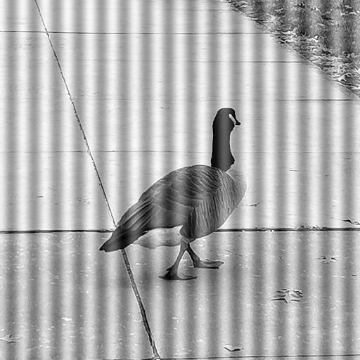
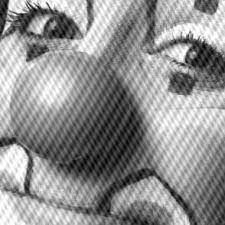
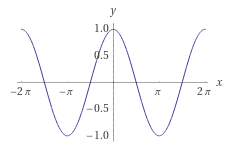
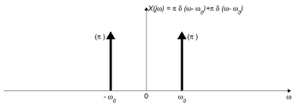

# Program do usuwania szumów periodycznych poprzez manipulację widmem fourierowskim

Moim zadaniem było napisać program do usuwania szumów periodycznych z obrazów przez manipulację widmem fourierowskim.

Szumem nazwiemy obecność artefaktów w obrazie, które nie są wynikiem rejestrowanego procesu bądź sceny. Usuwanie szumów z obrazu jest szczególnym rodzajem obróbki bądź restoracji zdjęcia.

W tej pracy zajmę się usuwaniem szczególnego rodzaju szumu, szumami periodycznymi.

Szumy periodyczne to rodzaj zakłóceń powtarzającego się w regularnych odstępach. Bierze się on m. in. ze sprzężeń elektrycznych w urządzeniach rejestrujących braz, np. w skanerach.

Przykłady obrazów z szumami periodycznymi:

Teraz przedstawię zagadnienie widma fourierowskiego. 

Transformacja Fouriera to operacja liniowa polegająca na rozłożeniu dowolnej funkcji na sumę sinusów i cosinusów o różnych częstotliwościach i różnych amplitudach. Funkcja opisująca zależność amplitudy od częstotliwości nazywana jest widmem funkcji.

Zatem szukamy odpowiedzi na pytanie:

Dla danej funkcji $f(x)$ jakie muszą być $A(\omega)$ i $B(\omega)$, aby była spełniona równość:

$$f(x) = \int_{\omega}\big[ A(\omega) \cos(\omega x) + i B(\omega) \sin(\omega x)\big]\text d\omega$$

Jeśli $f(x) = \cos(x)$, to:

natomiast transformacja Fouriera:

Jeśli $f(x)$ ma na przykład postać funkcji piły

https://www.spiedigitallibrary.org/conference-proceedings-of-spie/4667/0000/Frequency-domain-medianlike-filter-for-periodic-and-quasi-periodic-noise/10.1117/12.467980.short

https://ietresearch.onlinelibrary.wiley.com/doi/10.1049/iet-ipr.2018.5707