# Program do usuwania szumów periodycznych poprzez manipulację widmem fourierowskim

Igor Nowicki

Wyższa Szkoła Informatyki Stosowanej i Zarządzania
pod auspicjami Polskiej Akademii Nauk

----------

## Szumy periodyczne

Artefakty pochodzące z okresowych zakłóceń w procesie akwizycji obrazu.

##### Przykłady

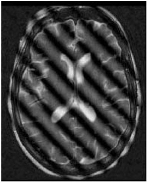
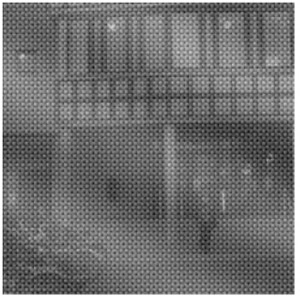
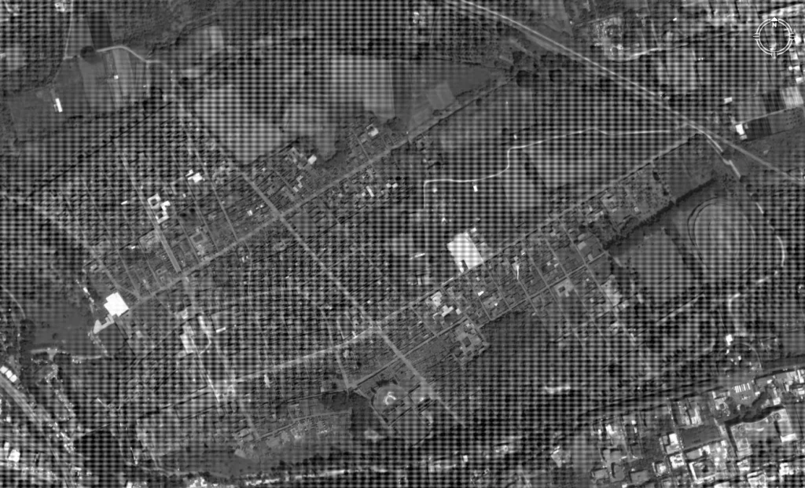

Źródła:
<ul>
<li>https://ietresearch.onlinelibrary.wiley.com/doi/10.1049/iet-ipr.2018.5707</li>
<li>https://craftofcoding.wordpress.com/2017/02/18/image-processing-fun-with-fft-ii/</li>
</ul>

---------

## Idea

Dowolnie skomplikowaną funkcję ciągłą okresową możemy przybliżać za pomocą sinusów i cosinusów o coraz wyższych częstotliwościach.

 

<!-- 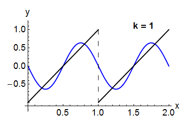 -->
<!-- 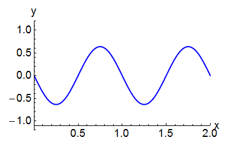 -->
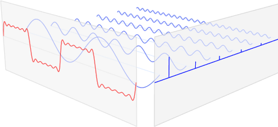

---------

## Podstawa matematyczna

Obraz zostaje przeniesiony do dziedziny częstotliwości:

$$Im(x,y) \to F(x,y),$$

gdzie $F(x,y)$ jest widmem fourierowskim obrazu $Im(x,y)$.

$$Im(x,y) = \frac{1}{N^2} \sum_{u=0}^{N-1} \sum_{v=0}^{N-1} F(u,v) e^{-2\pi i \frac{ux+vy}{N}}$$

---------

## Zastosowanie

Widmo fourierowskie obrazu z szumem periodycznym ma łatwe do oddzielenia cechy w porównaniu do widma oryginalnego obrazu.

 

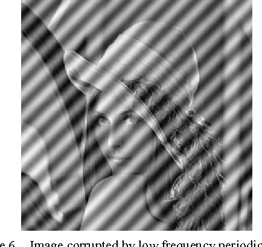

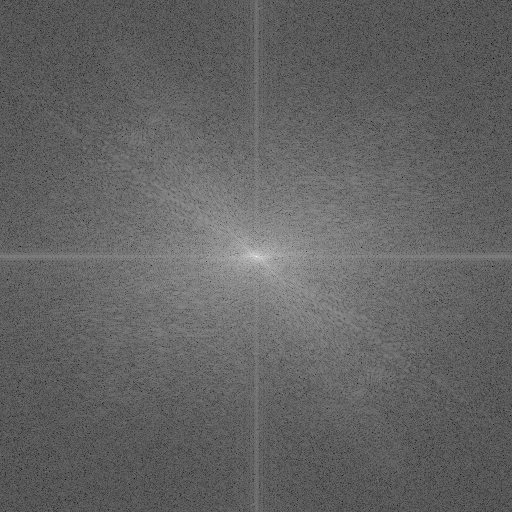
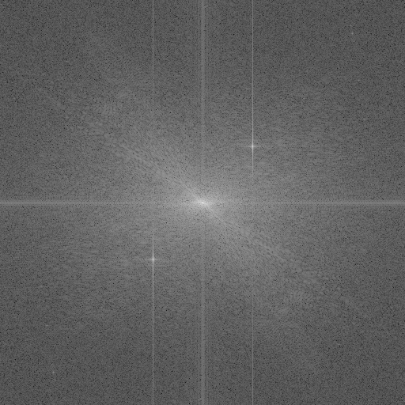

---------

## Algorytm usuwania szumów periodycznych

1. Przekształcenie obrazu do widma fourierowskiego
2. Zerowanie wartości z widma dla ustalonych zakresów wyższych częstotliwości
3. Odwrotne przekształcenie zmienionego widma do obrazu

<!-- ---------

## Metoda postępowania

Obróbka obrazu w dziedzinie częstotliwości

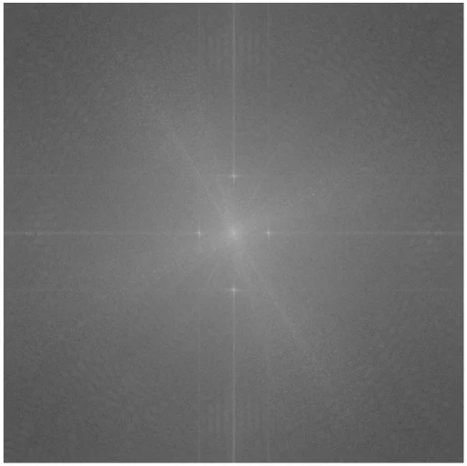

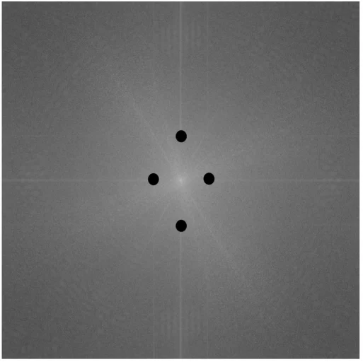

 

 -->

---------

## Prezentacja

Użyty zostanie program przygotowany w ramach zajęć z przedmiotu Algorytmy przetwarzania obrazów: ImageProcessor.

 

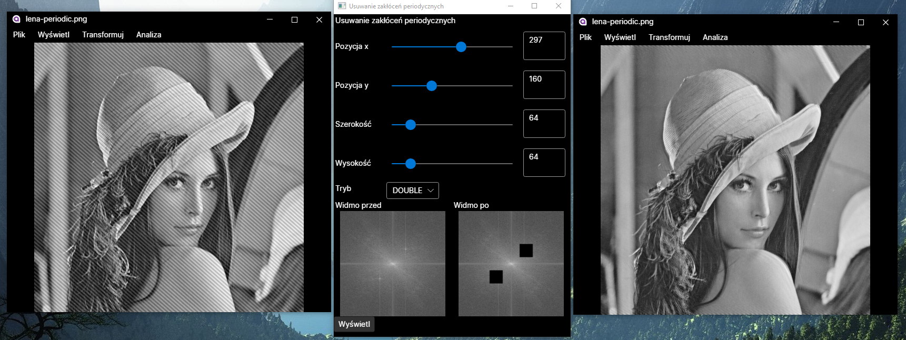

---------

## Opis środowiska programistycznego

Program został przygotowany w języku C#, w środowisku Visual Studio 2022, z użyciem frameworka .NET 6.
 

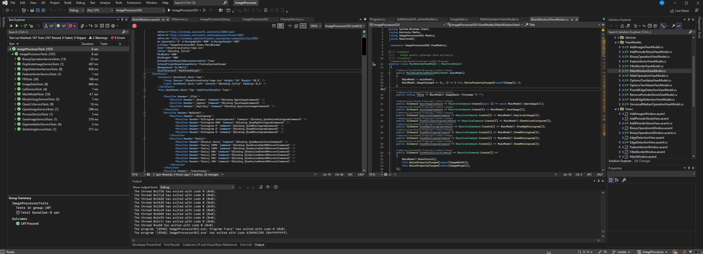

---------

## Powłoka graficzna

Interfejs użytkownika został przygotowany z użyciem frameworka Avalonia, w architekturze model-widok-model widoku (MVVM).

 

---------

## Architektura MVVM

- Widok odpowiada za wygląd zewnętrzny aplikacji,
- Model widoku odpowiada za interakcję widoku z modelem,
- Model odpowiada za przechowywanie i transformację danych.

## Biblioteka programistyczna

Biblioteka programistyczna została przygotowana z użyciem modułów OpenCV oraz FFTW.NET.

 

---------

## Moduł testów jednostkowych

Testy jednostkowe zostały przygotowane z użyciem biblioteki MSTest. Przeprowadzane testy gwarantują poprawność działania algorytmów oraz umożliwiają ich sprawną refaktoryzację.
 

---------

## Dokumentacja

Dokumentacja została wykonana z użyciem biblioteki DocFX, umożliwiającej automatyczne generowanie z kodu źródłowego.

 

---------

## System kontroli wersji

Do przechowywania kodu źródłowego i zarządzania wersjami zostało wykorzystane repozytorium GitHub.
 

Strona projektu: https://github.com/Ch3shireDev/ImageProcessor/

---------

## Zakończenie

Dziękuję za uwagę.

 

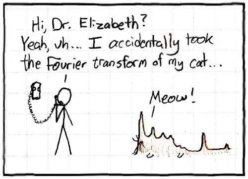

